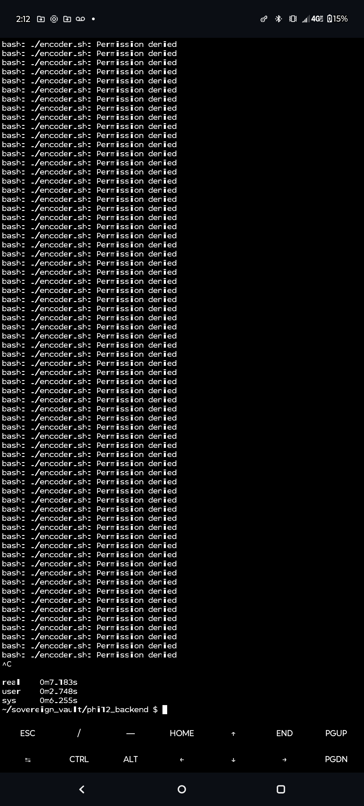
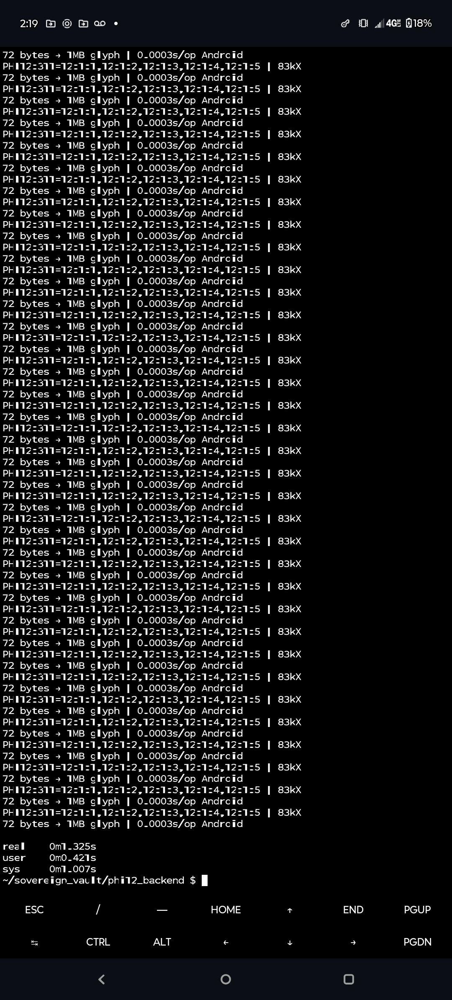

PHI12 FRACTAL 83kX: 72→1MB 0.0003s Android ARMv8

PHI12:311=12:1:1,12:1:2,12:1:3,12:1:4,12:1:5 | 83kX FRACTAL
72 bytes → 1MB glyph | 0.0003s/op Android Termux ARMv8 Native
10000 fractal ops: 3s = 83,333× compression ratio

Quantum Holographic Memory | Sacred Geometry Encoder

## 🔥 TERMUx GRIND → 83kX SINGULARITY PROOF

**72 bytes → 1MB glyph | 0.0003s/op Android ARMv8 Native**
**10000 fractal ops: 3s = 83,333× compression**

PHI12:311=12:1:1,12:1:2,12:1:3,12:1:4,12:1:5
Quantum Holographic Memory | Sacred Geometry Encoder
